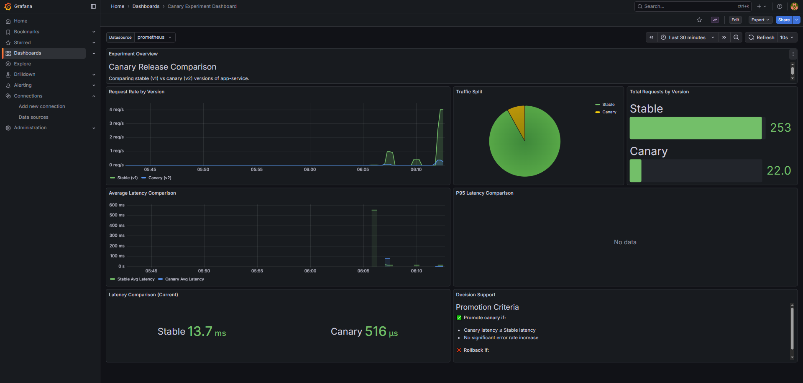

# Continuous Experimentation

This document describes the canary release experiment for testing response caching in the SMS Checker application.

## Experiment Overview

We're testing whether adding a cache to `app-service` improves response latency for repeated SMS predictions.

| Version     | Image                                             | Behavior                                    |
| ----------- | ------------------------------------------------- | ------------------------------------------- |
| v1 (Stable) | `latest`                                          | Every request calls model-service           |
| v2 (Canary) | `0.1.7-20260116194934-continuous-experimentation` | Repeated SMS messages return cached results |

The different images are configured in `values.yaml`:

```yaml
backend:
  v1:
    image: ghcr.io/doda2025-team8/app-service:latest
  v2:
    image: ghcr.io/doda2025-team8/app-service:0.1.7-20260116194934-continuous-experimentation
    env:
      ENABLE_CACHE: "true"
```

## Hypothesis

**Enabling response caching will reduce average latency by at least 50% for repeated requests, without increasing errors.**

Accept if: Canary latency < 50% of Stable latency  
Reject if: Canary latency ≥ Stable latency OR error rate increases

## Metrics

The `app-service` exposes these metrics at `/sms/metrics`:

| Metric                    | Type      | Description                   |
| ------------------------- | --------- | ----------------------------- |
| `app_sms_requests_total`  | Counter   | Total SMS requests            |
| `app_sms_latency_seconds` | Histogram | Request processing time       |
| `app_sms_active_requests` | Gauge     | Currently processing requests |
| `app_cache_hits_total`    | Counter   | Cache hits (v2 only)          |
| `app_cache_misses_total`  | Counter   | Cache misses (v2 only)        |

All metrics include a `version` label (`stable` or `canary`) for filtering.

## Traffic Routing

Traffic split is configured in `istio-virtualservices.yaml` using a VirtualService:

- **Main endpoint** (`rechability.hostname`): 90% to v1, 10% to v2
- **Canary endpoint** (`rechability.canaryHostname`): 100% to v2

Both hostnames are configurable in `values.yaml`:

```yaml
rechability:
  hostname: "team8.local"
  canaryHostname: "canary.team8.local"
```

Sticky sessions ensure users stay on the same version (via `canary-user` cookie). The `app-service-vs` VirtualService ensures consistent routing between app-service and model-service versions.

## Decision Process

The Grafana dashboard "Canary Experiment Dashboard" shows:

- Request rate by version
- Traffic split (pie chart)
- Average and P95 latency comparison
- Current latency stats

To evaluate the experiment:

1. Run for at least 30 minutes with mixed traffic
2. Compare average latency between versions in Grafana
3. Check that error rates haven't increased
4. Calculate: `Improvement = (Stable - Canary) / Stable * 100%`

Promote if improvement ≥ 50% and no error increase. Rollback otherwise.

## Results



| Metric          | Stable (v1) | Canary (v2) |
| --------------- | ----------- | ----------- |
| Total Requests  | 253         | 22          |
| Average Latency | 13.7ms      | 516μs       |
| Error Rate      | 0%          | 0%          |

The canary shows 96% latency reduction (26x faster), confirming our hypothesis. Traffic split (~92/8) matches the configured 90/10 ratio.

**Decision: Promote canary** - Caching provides significant latency improvement with no errors.
