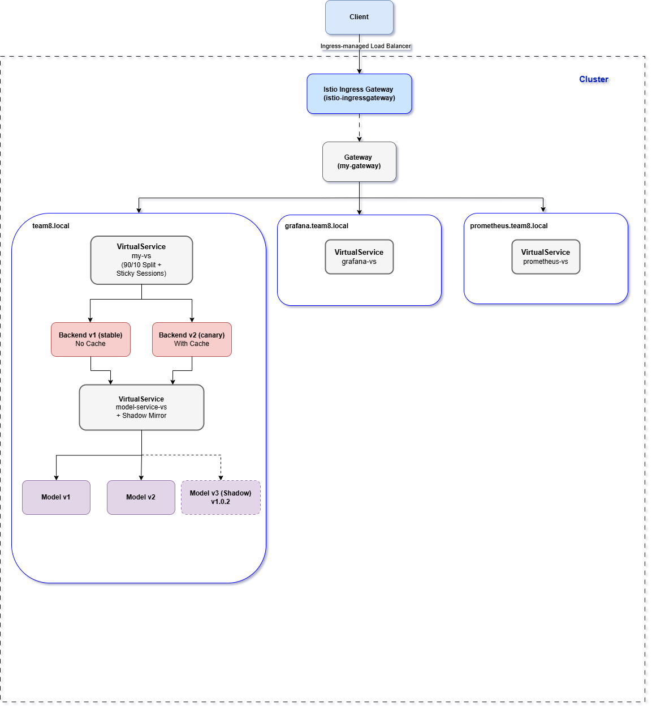
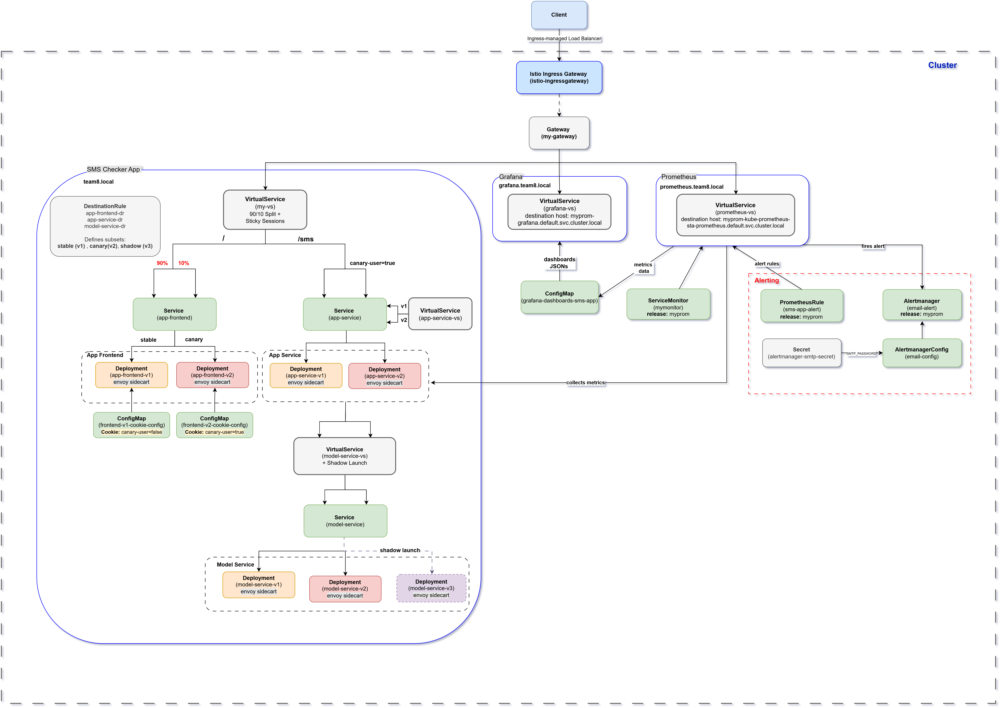

# DODA 2025-2026 Team 8 - Deployment Documentation

Yanzhi Chen  
Hendrik Lambert  
Vincent Ruijgrok  
Yuchen Sun  
Andriana Tzanidou  
Horia Zaharia  

## Table of Contents

- [Introduction](#introduction)
- [Architecture Overview](#architecture-overview)
- [Deployment Structure](#deployment-structure) 
- [Data Flow of Requests](#data-flow-of-requests)

## Introduction 
The goal of this document is to describe the deployment structure  and deployment data flow of the SMS Checker app. The app is deployed in Kubernetes with Istio service mesh. Additionally, it implements a canary release to a small fraction of its users (90/10 traffic split) with Sticky Sessions and an additional use case, a Shadow Launch, which mirrors traffic to a new model version. An experiment is run to evaluate a canary release of the app to a small fraction of its users which enables caching model responses to improve latency. This document presents an overview of the deployment architecture, provides information on all deployed components and their relationships, a description of the request flow through the deployed cluster and a quick reference guide on how to access the application.

## Architecture Overview 
<!--Add a high level diagram of the architecture and a general description.-->

Figure 1: High level diagram of application deployment    

In Figure 1 the final architecture of the deployed application is depicted. The architecture leverages Kubernetes advanced deployment capabilities, monitoring and Istio for traffic management and continuous experimentation. All application components are deployed via a Helm chart and monitoring, including alerting, is enabled through Prometheus alongside Grafana for advanced dashboarding.

All external client traffic enters the cluster via an istio `Ingress Gateway` which is assumed to be available in the cluster. The app is installed in the cluster through its helm chart. The app defines an istio `Gateway` (my-gateway) resource which is linked to the istio `IngressGateway` by referring to the labels of the IngressGateway in the selector. The deployment uses the default label `istio: ingressgateway`. However, non-standard Istio installations may use different label names. The name of the `Gateway` is defined in the values of the helm chart but it can be overwritten to allow the deployment to be installed into different clusters that might use different names for the gateway. Moreover, the `Gateway` exposes the app under configurable hostnames and paths. These are defined and can be overwritten in the values of the helm chart. 

The current deployment uses the following hostnames and paths: 
<!--Add path /sms and metrics paths-->

| Hostname                 | Port | Path |  |
|--------------------------|------|------|---------|
| team8.local              | 8080   | /    | SMS Checker app |
| canary.team8.local       | 8080   | /    | Prereleased app (canary version) used for experimentation |
| prometheus.team8.local   | 8080   | /    | Prometheus web UI for metrics inspection and alerting|
| grafana.team8.local      | 8080   | /    | Grafana web UI for dashboarding 

An istio `VirtualService` (my-vs) is attached to the `Gateway` which is responsible for traffic routing to the SMS Checker app frontend, weighted traffic splitting (90/10) and Sticky Sessions. Sticky Sessions are implemented using a cookie (canary-user=true or canary-user=false), set by the frontend, such that the user selected for the canary version consistently sees the same version on subsequent requests. `DestinationRules` resources are responsible for defining subsets for the stable and canary releases and also for the Shadow Launch, enabling version-aware routing.

The app and its services (app-frontend, app-service, model) are deployed in multiple versions:
- A **Stable (v1)** deployment which serves most of the user (90%).
- A **Canary (v2)** deployment which serves a small fraction of the users (10%) and it is used for experimentation. This pre-release version of the `app-service` introduces a new feature in the app service. This new feature allows for caching model responses to improve latency.
- A **Shadow Launch (v3)** deployment introduces a new instance of the model service which mirrors existing traffic from v1 and v2 and runs a newer model version. The new model version is not exposed to the users and custom metrics are implemented in `model-service` to evaluate the new version.

`Virtual Services` app-service-vs and model-service-vs are implemented for ensuring that traffic is routed to the correct version (v1/v2) of the corresponding service.

An additional istio `VirtualService` (prometheus-vs) is attached to the `Gateway` and routes incoming traffic to the Prometheus instance, allowing access to its web UI (prometheus.team8.local). Prometheus is configured for app monitoring and alerting. The application exposes metrics which give insights into the usability of the app and the canary release, facilitating decision making on  the preferability of the new `app-service` version. These metrics are exposed by the `app-service` through an endpoint (\metrics). The metrics are automatically collected by Prometheus through a `ServiceMonitor` resource. Moreover, Prometheus `AlertManager` is configured with  a `PrometheusRule` for alerting users via email when the application receives more than 15 requests.

Similarly, an istio `VirtualService` (grafana-vs) is attached to the `Gateway` for routing traffic to the Grafana instance, allowing access to its UI (grafana.team8.local). Grafana is configured for visualizing the metrics. Two custom dashboards have been created that can be automatically added to Grafana during the app installation. One dashboard is for visualizing the general operation of the app and the other dashboard is used to illustrate the differences between the deployed versions in the experiment.

<!--More detailed info of the above will be provided below-->

## Deployment Structure
<!--Include all deployed resource types and their relations.
It is unnecessary to include all details for each CRD, but effects and relations should become clear. Mention about canary release(90/10) split, experiment (not in detail has each own doc), alerting, additional use case. Dont forget to mention here plain K8s deployment with Ingress (no Istio) Which component implements the additional use case?-->

Figure 2: Deployment Structure Diagram  

Figure 2 provides a detailed view of all deployed components and their connections. Details of all deployed resource types and their relations can be found below.

### Deployed Components

### Routing
---

### 1. Gateway (my-gateway) 
**Name:**  my-gateway   
**Type:** Gateway   
**Description:**  It defines how external traffic enters the cluster. It declares the hosts and ports that the Istio Ingress Gateway should handle for accessing the SMS Checker App, Grafana and Prometheus.   
**Connections:** 
- Binds to Istio Ingress Gateway
- Referenced by VirtualService resources (my-vs, grafana-vs, prometheus-vs)

### SMS Checker App
---
### 2. VirtualService (my-vs)
**Name:**  my-vs   
**Type:**  VirtualService    
**Description:**  The Virtual Service defines how traffic is routed once it enters the mesh via a Gateway. my-vs is responsible for routing incoming traffic from the Gateway to the app-frontend Service. It implements the 90/10 traffic split, directing 90% of the requests to the stable version (v1) and 10% to the canary version (v2). It enforces cookie-based sticky sessions such that when a user has been assigned to v1 or v2, subsequent requests are routed to the same version. 
- Requests with cookie `canary-user=false` are routed to the stable version (v1) 
- Requests with cookie `canary-user=true` are routed to the canary version (v2) 
- Any request without the cookie is handled according to the 90/10 and a cookie is set later by the frontend.

**Connections:**  
- Routes to Service (app-frontend) subsets stable (v1) or canary (v2) based on the DestinationRule for app-frontend. 

### 3. DestinationRule (app-frontend-dr)
**Name:**  app-frontend-dr   
**Type:**  DestinationRule      
**Description:** It defines traffic policies and subsets (v1, v2) for the frontend service using pod labels.     
**Connections:**  
- It applies to Service (app-frontend) to the deployments app-frontend-v1 and app-frontend-v2.

### 4. Service (app-frontend)
**Name:** app-frontend       
**Type:** Service
**Description:**  Provides a stable endpoint for accessing the app-frontend's pods based on the defined DestinationRule subsets.    
**Connections:** 
- Routes to app-frontend (v1) pods created by `app-frontend-v1`Deployment and app-frontend (v2) pods created by `app-frontend-v2` based on the DestinationRule subsets. 

### 5. Deployment (app-frontend-v1)
**Name:** app-frontend-v1    
**Type:** Deployment    
**Description:** Creates the pods that run the stable version of the frontend which are injected with an Istio sidecar proxy and are labeled with version v1. It receives 90% of the traffic.      
**Connections:**      
- It mounts ConfigMap (frontend-v1-cookie-config) which sets cookie `canary-user=false` for the stable release. 

### 6. Deployment (app-frontend-v2)
**Name:** app-frontend-v2   
**Type:** Deployment   
**Description:** Creates the pods that run the canary version of the App Frontend which are injected with an Istio sidecar proxy and are labeled with version v2. It receives 10% of the traffic.      
**Connections:** 
- It mounts ConfigMap (frontend-v2-cookie-config) which sets cookie `canary-user=true` for the canary release.

### 7. ConfigMap (frontend-v1-cookie-config)
**Name:**  frontend-v1-cookie-config  
**Type:**  ConfigMap  
**Description:**  Configures the cookie `canary-user=false` for the stable release.   
**Connections:**
- It gets mounted by `app-frontend-v1`.
### 8. ConfigMap (frontend-v2-cookie-config)
**Name:**  frontend-v2-cookie-config  
**Type:**  ConfigMap  
**Description:**   Configures the `canary-user=true` cookie for the canary release.      
**Connections:**
- It gets mounted by `app-frontend-v2`.

### 8. VirtualService (app-service-vs)
**Name:**  app-service-vs   
**Type:**  VirtualService   
**Description:**  It routes traffic to the App Service.    
**Connections:**
- Routes to Service (app-service) subsets stable (v1) or canary (v2) based on the DestinationRule for app-service.
- Receives traffic from either `app-frontend-v1` pods or `app-frontend-v2` pods.

### 9. DestinationRule (app-service-dr)
**Name:**  app-service-dr      
**Type:**  DestinationRule      
**Description:**  It defines traffic policies and subsets (v1, v2) for the App Service using pod labels.   
**Connections:**      
- It applies to Service (app-service) to the deployments app-service-v1 and app-service-v2.

### 10. Service (app-service)
**Name:**  app-service
**Type:**  Service
**Description:**  Provides a stable endpoint for accessing the app service's pods based on the defined DestinationRule subsets.   
**Connections:**  
- Routes to app-service (v1) pods created by `app-service-v1` Deployment and app-service (v2) pods created by `app-service-v2` based on the DestinationRule subsets. 

### 11. Deployment (app-service-v1)
**Name:**  app-service-v1   
**Type:**  Deployment   
**Description:**  Creates the pods that run the stable version of the app service which are injected with an Istio sidecar proxy and are labeled with version v1. It receives 90% of the traffic.      
**Connections:**
- Receives traffic from the frontend

### 12. Deployment (app-service-v2)
**Name:**  app-service-v2    
**Type:**  Deployment    
**Description:** Creates the pods that run the canary version of the app service which are injected with an Istio sidecar proxy and are labeled with version v2. It receives 10% of the traffic. This instance is a prerealese of app service implementing the experiment.      
**Connections:**
- Receives traffic from the frontend

### 13. VirtualService (model-service-vs)
**Name:**  model-service-vs    
**Type:**  VirtualService    
**Description:**  It routes traffic to the Model Service and implements the additional use case the Shadow Launch.    
**Connections:**  
- Routes to Service (model-service) subsets stable (v1) or canary (v2) based on the DestinationRule for app-frontend and mirrors 100% of the traffic (copy requests) to another model-service subset (v3).
- Receives traffic from either `app-service-v1` pods or `app-service-v2` pods.

### 14. DestinationRule (model-service-dr)
**Name:**  model-service-dr     
**Type:**  DestinationRule     
**Description:**  It defines traffic policies and subsets (v1, v2, v3) for the Model Service using pod labels.   
**Connections:**   
- It applies to Service (model-service) to the deployments model-service-v1, model-service-v2 and model-service-v3.

### 15. Service (model-service)
**Name:**  model-service      
**Type:**  Service      
**Description:**   Provides a stable endpoint for accessing the model-service's pods based on the defined DestinationRule subsets.
**Connections:**    
- Routes to model-service (v1) pods created by `model-service-v1` Deployment, model-service (v2) pods created by `model-service-v2` and model-service (v3) pods created by `model-service-v3`  based on the DestinationRule subsets. 

### 16. Deployment (model-service-v1)
**Name:** model-service-v1   
**Type:**  Deployment   
**Description:**  Creates the pods that run the stable version of the model service which are injected with an Istio sidecar proxy and are labeled with version v1. It receives 90% of the traffic.    
**Connections:**
It receives traffic from app-service pods of version (v1).

### 17. Deployment (model-service-v2)
**Name:**  model-service-v2     
**Type:**  Deployment 
**Description:**  Creates the pods that run the canary version of the model service which are injected with an Istio sidecar proxy and are labeled with version v2. It receives 10% of the traffic.
**Connections:**

### 18. Deployment (model-service-v3)
**Name:**  model-service-v3       
**Type:**  Deployment   
**Description:**  This is a shadow Deployment of the model-service which uses a newer version of the model. Pods receive mirrored traffic without sending responses to the client.
**Connections:**
- It receives mirror traffic from VirtualService `model-service-vs`.

### Grafana
---
### 19. VirtualService (grafana-vs)
**Name:**  grafana-vs    
**Type:**  VirtualService    
**Description:**  It routes traffic from the Gateway to the Grafana service.   
**Connections:**
- Routes to Service `myprop-grafana.default.svc.cluster.local`. 

### 20. ConfigMap (grafana-dashboards-sms-app)
**Name:**  grafana-dashboards-sms-app   
**Type:**  ConfigMap   
**Description:**  It defines two dashboards (one for the SMS Checker App and one for the experiment) which collect data from the Prometheus instance.  `grafana_dashboard: "1"` is set for Grafana to automatically detect and pick up the dashboards when the pods are deployed.   
**Connections:**   
- It gets mounted by Grafana deployed pods.

### Prometheus
---
### 21. VirtualService (premetheus-vs)
**Name:**   VirtualService  
**Type:**    
**Description:**  It routes traffic from the Gateway to the Prometheus service.     
**Connections:**  
- Routes to Service `myprom-kube-prometheus-sta-prometheus.default.svc.cluster.local`.

### 22. ServiceMonitor (mymonitor)
**Name:**  mymonitor
**Type:**  ServiceMonitor
**Description:**  It is defined to make the app-service discoverable by Prometheus such that it can scrape the metrics defined at the `/metrics` endpoint in the app-service.
**Connections:**
- It watches app-service and its endpoints.

### 23. PrometheusRule (sms-app-alert)
**Name:**  sms-app-alert   
**Type:**  PrometheusRule  
**Description:**  It defines alerting rules for the SMS App Check app. It specifies that if the app receives more than 15 requests per minute for two minutes straight, Prometheus should fire an alert.  
**Connections:**   
 - It is evaluated by Prometheus through collecting app metrics.    

Description: This PrometheusRule defines alerting conditions for the SMS App Check application. For example, it specifies that if the app receives more than 15 requests per minute for a continuous two-minute period, Prometheus should generate an alert. Note that the rule itself does not send notifications—Prometheus evaluates the condition, and any resulting alerts are handled by Alertmanager.
Connections / Usage:

Evaluated by Prometheus against metrics scraped from the app.

Alerts generated are sent to Alertmanager for notification and routing.

### 24. Alertmanager (email-alert)
**Name:**  email-alert   
**Type:**  Alertmanager  
**Description:**  It receives alerts, defined in PrometheusRules, by Prometheus and sends notifications. Here it configured to send emails.   
**Connections:**  
- It receives alert from Prometheus
- Sends notifications according to configuration in AlertmanagerConfig.

### 25. AlertmanagerConfig (email-config)
**Name:**  email-config   
**Type:**  AlertmanagerConfig   
**Description:**  It configures all settings for sending a notification e.g. the type of notification, the recipient email address if the notification is email.
**Connections:**   
- It is used by Alertmanager to define alert behavior.

### 26. Secret (alertmanager-smtp-secret)
**Name:**  alertmanager-smtp-secret   
**Type:**  Secret   
**Description:**  It defines a secret for storing sensitive information. Here it stores `SMTP_PASSWORD`, a password that it is used by email receives via SMTP settings.   
**Connections:**   
- It it mounted to AlertmanagerConfig.  

####

<!--
### Kubernetes:
#### Deployments
#### Services
#### Alerting
#### Ingress 

### Istio Service Mesh:

#### Traffic Management and Continuous Experimentation:
#### VirtualServices
#### Configmaps

#### Additional Use Case: Shadow Launch

#### App Monitoring
-->

## Data Flow of Requests
<!--Describe the flow of incoming requests to the cluster. Show and elaborate the flow of requests in the cluster, including the
dynamic traffic routing in your experiment. 
• Which path does a typical request take through your deployment?
• Where is the 90/10 split configured? Where is the routing decision taken?
Add data flow diagrams-->
